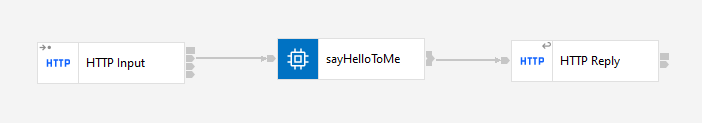
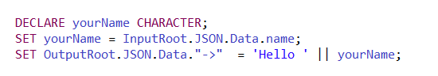

# Description

`Hello to me` application is a demonstration of the possibilities of working on the IBM ACE bus version 12.0.5. It does not execute business functionality. 

The application receives data from client, and then returns "Hello"  + {*yourName*} string to the client in .json format and provides the following endpoint:

**`/acehelloworld/v2:`**

Using a *POST* method, it sends a data to the application and receives in response a string "Hello" + yourName. 

# Implementation

**`Hello to me`**

The `HTTP Input` node receives the request with data containing a json object with key and value. The `sayHelloToMe` compute node creates the message tree and message body:

 Finally, `HTTP Reply` node sends the message to the client.

 # Format

 The app uses .json 